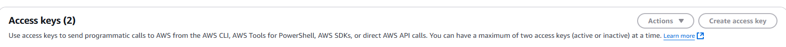

# EK1031-Infrastructure-as-Code
**authors** Kacper Bohaczyk , Sergej Rychkov


## Aufgabenbeschreibung
Bearbeitung des AWS-Tutorials [1]

## Umsetzung


### EKv - Automatisiertes Deployment von drei virtuellen Maschinen in AWS

*Zielsetzung*
> Automatisches Erstellen von 3 virtuellen Maschinen (VMs) in AWS mithilfe von Terraform – ohne manuelle Nutzung der AWS-Weboberfläche.

- Spart Zeit, ist wiederholbar (idempotent) und nachvollziehbar.

### Voraussetzungen
- *AWS-Konto* → Zugang zur [AWS-Konsole](https://aws.amazon.com/console)
- *IAM-Benutzer mit Zugriffsschlüssel*  
    → Erstellen eines Zugriffsschlüssels (Access Key + Secret Key)  
    → [IAM-Zugriffsschlüssel generieren](https://docs.aws.amazon.com/de_de/IAM/latest/UserGuide/id_credentials_access-keys.html)
- *Terraform lokal installieren* → Anleitung: Terraform Install Guide
- *AWS CLI* → Nützlich für Tests oder direkten Zugriff auf die AWS API (mit aws configure alles ohne im Code zu bearbeiten erstellen.)


#### AWS configure zum setzten:

```bash
aws configure
```
Folgendes sollte rauskommen(und entsprechend gesetzt werden, bei region und output kann man einfach leer lassen.):
AWS Access Key ID [**]: 
AWS Secret Access Key [**]: 
Default region name [None]: 
Default output format [None]:

### Projektstruktur
```css
learn-terraform-aws-instance/
│
├── variables.tf
├── main.tf
├── outputs.tf
```

**variables.tf**
- Hier werden *Variablen* definiert (z. B. Anzahl der VMs, Typ, Betriebssystem).  
Variablen ermöglichen Wiederverwendbarkeit und Anpassbarkeit, ohne den Code direkt ändern zu müssen.

**main.tf**
- Die main.tf ist die zentrale Terraform-Datei, die die Infrastruktur definiert. Sie enthält Provider-Konfigurationen, Ressourcen und Variablen zur automatisierten Bereitstellung von Cloud-Ressourcen.

**outputs.tf**
- definiert die Ausgaben von Terraform, um wichtige Informationen über bereitgestellte Ressourcen anzuzeigen. Sie kann Werte wie öffentliche IP-Adressen, Instanz-IDs oder Verbindungs-URLs enthalten, die nach der Bereitstellung leicht abrufbar sind.

### Wichtige Terraform-Befehle

- terraform init → Terraform lädt alle notwendigen Plugins (z. B. für AWS) und bereitet das Projekt vor.
- terraform plan → Zeigt an, welche Änderungen Terraform vornehmen würde, bevor etwas ausgeführt wird.
- terraform apply → Führt den geplanten Code aus und erstellt die Infrastruktur in AWS (in diesem Fall 3 VMs).
- terraform destroy → Löscht alle erstellten Ressourcen.

### Konfiguration in AWS
Unter  IAM/Security credentials
- Access Keys bearbeiten und eins für die Instanzierung erstellen:


## Bewertung

### Erweiterte Anforderungen *überwiegend erfüllt*
- [x] Installation und Funktionstest von Terraform in einer VM

### Erweiterte Anforderungen *vollständig erfüllt*
- [x] Deployment von drei virtuellen Maschinen in der Cloud

## Quellen
* [1] [Terraform Tutorials](https://developer.hashicorp.com/terraform/tutorials)
* [2] https://spacelift.io/blog/terraform-files
* [3] https://docs.aws.amazon.com/prescriptive-guidance/latest/terraform-aws-provider-best-practices/structure.html
* [4] https://developer.hashicorp.com/terraform/cli/commands
* [5] https://docs.aws.amazon.com/cli/latest/userguide/install-cliv2.html